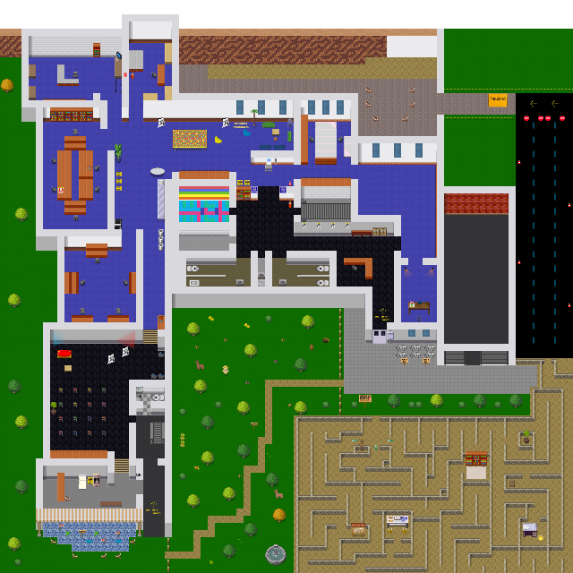

# Verschwörhaus WorkAdventure Map

Virtual meeting space for online events and pandemic times. Running instance: [meet.verschwoer.haus](https://meet.verschwoer.haus/).

## Jitsi-Rooms

* [Bällebad](https://coremeet.workadventu.re/globalvsh-baellebad)
* [Aufzug](https://coremeet.workadventu.re/globalvsh-aufzug)
* [Couchecke](https://coremeet.workadventu.re/globalvsh-couchecke)

## How to build

The map is defined in the file [main.json](main.json), which can be edited with [Tiled](https://www.mapeditor.org/).

Helpful resources:
- [Tiled documentation](https://doc.mapeditor.org/en/stable/manual/introduction/)
- [Tiled video tutorials](https://www.gamefromscratch.com/post/2015/10/14/Tiled-Map-Editor-Tutorial-Series.aspx)
- [WorkAdventure documentation](https://github.com/thecodingmachine/workadventure/#designing-a-map)
- [HowTo rC3 World](https://howto.rc3.world/maps.html)

## Tilesets

Apart from the default WorkAdventure tilesets, this project uses 

* the rC3-Tilesets by CERT - licensed [CC-BY-SA](https://github.com/verschwoerhaus/vsh-workadventure/blob/master/tilesets/cert/LICENSE.md).
* the phenomenal [Wikipaka tileset](https://wikipaka.world/tilesets/wikipaka/wikipaka.png) by [@hastern](https://github.com/hastern)/Jugend hackt
* some [VSH tiles](https://github.com/verschwoerhaus/vsh-workadventure/blob/master/tilesets/vsh/vsh.png) by the community

## Known issues

* Sometimes while rendering a tile, WorkAdventure also displays the first pixels of the tile next to it, which causes weird stripes occuring randomly. This problem can be solved by rearranging the tilesets with the [deinterpolate_tiles.py](deinterpolate_tiles.py) script. However, applying this script to an existing tileset implies manually updating all tiles that have already been used, since the arrangement of the tiles within the tileset is changed!